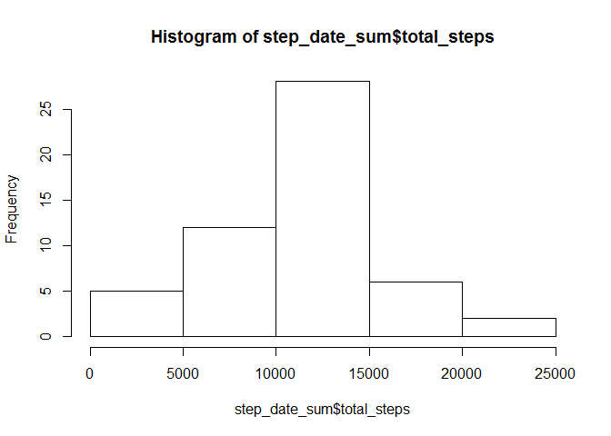
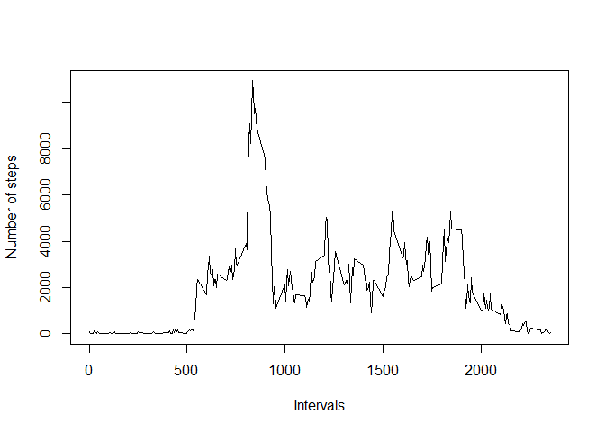
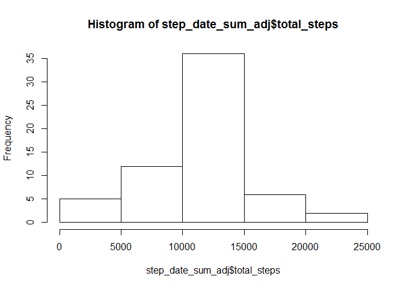
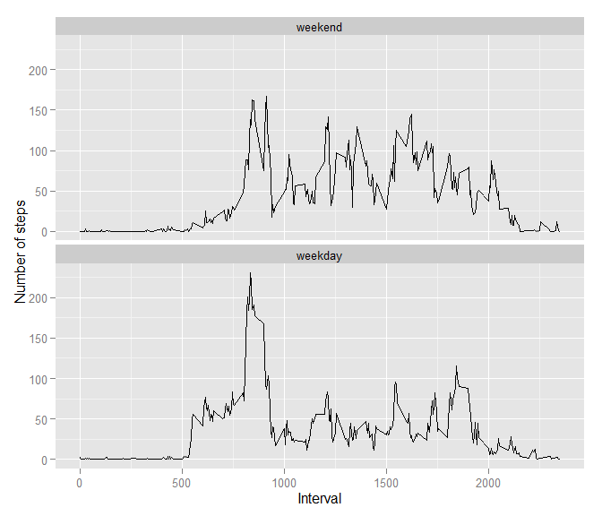

# Reproducible Research: Peer Assessment 1


This assignment makes use of data from a personal activity monitoring device. This device collects data at 5 minute intervals through out the day. The data consists of two months of data from an anonymous individual collected during the months of October and November, 2012 and include the number of steps taken in 5 minute intervals each day. The goal is to analyze the data with emphasis on dealing with missing samples and also difference between weekdays and weekend.

## Loading and preprocessing the data
First we have to load the data.


```r
activity <- read.csv("activity.csv")
```

## What is mean total number of steps taken per day?

1. Total number of steps taken per day


```r
step_date_sum <-  setNames(aggregate(activity$steps, by=list(activity$date), FUN=sum), c("date","total_steps")) 
```

2. Histogram of the total number of steps taken each day


```r
hist(step_date_sum$total_steps)
```

 

3. Mean and median of the total number of steps taken per day


```r
mean(step_date_sum$total_steps, na.rm = TRUE)
```

```
## [1] 10766.19
```

```r
median(step_date_sum$total_steps, na.rm = TRUE)
```

```
## [1] 10765
```

## What is the average daily activity pattern?
Clear data from NA values, then aggregate steps by interval and plot the graph.


```r
activity_no_na <- na.omit(activity)
step_interval_sum <- setNames(aggregate(activity_no_na$steps, by=list(activity_no_na$interval), FUN=sum), c("interval","total_steps")) 
plot(step_interval_sum$interval, step_interval_sum$total_steps, type="l", xlab= "Intervals", ylab= "Number of steps")
```

 

Which 5-minute interval, on average across all the days in the dataset, contains the maximum number of steps?


```r
subset(step_interval_sum, total_steps == max(step_interval_sum$total_steps), select=c(interval, total_steps))
```

```
##     interval total_steps
## 104      835       10927
```

## Imputing missing values

We have to discover the total number of missing values in the dataset. 


```r
nrow(activity[is.na(activity$steps),])
```

```
## [1] 2304
```

It is necessary to cleanse the data from missing values and replace them with suitable value. Appropriate strategy should be calculating the mean for each interval, then join with original data and replace missing values with relevant interval mean. 


```r
step_interval_mean <- setNames(aggregate(activity_no_na$steps, by=list(activity_no_na$interval), FUN=mean), c("interval","total_steps"))
activity_mean <- merge(activity, step_interval_mean, by.x = "interval", by.y = "interval")
activity_mean$steps[is.na(activity_mean$steps)] <- activity_mean$total_steps[is.na(activity_mean$steps)]

activity_adj <- setNames(data.frame(activity_mean$steps, activity_mean$date, activity_mean$interval), c("steps","date","interval"))
step_date_sum_adj <- setNames(aggregate(activity_adj$steps, by=list(activity_adj$date), FUN=sum), c("date","total_steps"))
```

Now it's possible to plot histogram for adjusted data.


```r
hist(step_date_sum_adj$total_steps)
```

 

We can see that mean value does not differ from the estimates from the first part of the report, however median value is different. That is because mean values used instead of NA can't change the mean itself, but new values emerges - in fact, replacing so many missed samples with mean formed a new median, which is now the same as mean.


```r
mean(step_date_sum_adj$total_steps, na.rm = TRUE)
```

```
## [1] 10766.19
```

```r
median(step_date_sum_adj$total_steps, na.rm = TRUE)
```

```
## [1] 10766.19
```

## Are there differences in activity patterns between weekdays and weekends?

Adjusting the values types, sorting the data to weekdays or weekend using factor and finally plotting graph for both types.


```r
activity_adj$date <- as.Date(activity_adj$date)

wdays <- c('Monday', 'Tuesday', 'Wednesday', 'Thursday', 'Friday')

activity_adj$day <- factor((weekdays(activity_adj$date) %in% wdays), 
         levels=c(FALSE, TRUE), labels=c('weekend', 'weekday'))
     
step_day_int_mean <- setNames(aggregate(activity_adj$steps, by=list(activity_adj$day, activity_adj$interval), FUN=mean), c("day_type","interval","total_steps"))
```

Using ggplot2 this time.


```r
ggplot(step_day_int_mean) +
geom_line(aes(x=interval, y=total_steps)) +
facet_wrap(~day_type, nrow=2) +
xlab("Interval") +
ylab("Number of steps") 
```

 

We can see that there are some differences in activity patterns, especially distinct peak in the weekdays morning. Inactivity period is similar in both cases.

## Conclusion

We found out several information regarding activity dataset (total number of steps taken per day with mean and median,...), plotted appropriate graphs, discovered differences between raw and adjusted data and investigated activity patterns during weekdays and weekend.
